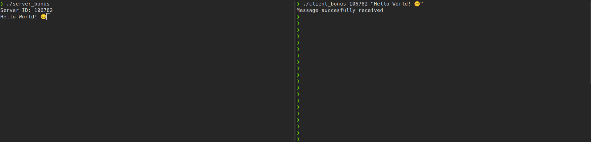

  

<h1 align="center">minitalk</h1>

[Subject](srcs/en.subject.pdf)

The purpose of this project is to code a small data exchange program using UNIX signals.

#### Mandatory
Produce server & client executables, theclient must communicate a string passed as a parameter to server (referenced by its process ID) which then displays it.
The comunication must be done using `SIGUSR1` and `SIGUSR2` signals ONLY

#### Bonus

Add a reception acknowledgement system and implement Unicode characters.

## Restrictions
&nbsp; We are only allowed to use the following functions:

* `write()`.
* `signal`.
* `sigemptyset`.
* `sigaddset`.
* `sigaction`.
* `kill`.
* `getpid`.
* `malloc`.
* `free`.
* `pause`.
* `sleep`.
* `usleep`.
* `exit`.
* [Our own](https://github.com/ThalesXS/42-ft_printf) `ft_printf()`.
* [Our own](https://github.com/ThalesXS/42-libft) `libft` library.

## Usage

  

Use `make`/`make bonus` inside the minitalk directory to compile the programs. Execute the `server` first and in a second terminal, execute the `client` program, indicating the PID presented by the server as the first argument, and a text as the second argument.